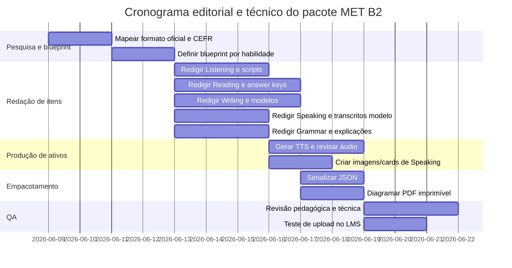

# Pacote de exercícios originais no estilo MET para plataforma online

## Resumo executivo

Este relatório transforma o pedido em um pacote editorial utilizável em LMS, baseado no formato **oficial e atual** do Michigan English Test. Hoje, o MET é um exame **digital**, **multinível**, de **quatro habilidades**, usado em contextos acadêmicos e profissionais; ele é desenvolvido pela Michigan Language Assessment, vinculada à University of Michigan, com apoio de expertise também divulgado pela Cambridge. O teste completo dura **155 minutos** e organiza-se em **Writing, Listening, Reading e Speaking**. No modelo atual, **Listening** e **Reading** são autocorrigidos por computador, enquanto **Writing** e **Speaking** são avaliados por avaliadores certificados. A faixa **B2** no relatório oficial do MET corresponde a **53–63** na escala padronizada de cada habilidade. citeturn21view0turn1view1turn3view2

A matriz oficial atual é a seguinte: **Writing** com duas tarefas em 45 minutos; **Listening** com 50 questões em 35 minutos distribuídas em três partes; **Reading** com 50 questões em 65 minutos, incluindo gramática em nível de sentença; e **Speaking** com cinco tarefas gravadas digitalmente, em cerca de 10 minutos, com prompts lidos na tela e em áudio. O MET enfatiza tarefas familiares, sem conhecimento especializado, em contextos sociais, acadêmicos e de trabalho. citeturn1view1turn18view0turn18view1turn18view2turn19view3turn12view0

Como o seu pedido inclui formatos que **vão além do núcleo oficial** do MET — por exemplo, **T/F/NG, matching, gapped text** em Reading e bancos de **Grammar** independentes — este pacote foi dividido editorialmente em duas camadas. A primeira é **Núcleo MET**, que respeita os formatos oficiais atuais. A segunda é **Extensão alinhada ao MET**, que preserva o construto B2 e as habilidades-alvo, mas usa formatos muito úteis em plataforma para treino diagnóstico, revisão e analytics. Essa distinção é essencial para manter fidelidade ao exame sem desperdiçar o potencial do ambiente digital. citeturn1view1turn18view0turn19view3turn11view1turn10search3

O pacote abaixo entrega **50 tarefas originais**, prontas para serialização em JSON e para composição em PDF imprimível, com **scripts, chaves, modelos, rubricas, metadados, estrutura de arquivos e recomendações de TTS**. Para QA, o benchmark recomendado é validar dificuldade, rubricas e UX contra os **sample tests oficiais gratuitos** e seus **answer keys** de Listening/Reading, além dos resource packs oficiais listados no hub de preparação do MET. citeturn1view0turn8view0

## Base de alinhamento ao MET e ao CEFR

A tabela abaixo resume a âncora oficial usada no desenho deste pacote.

| Habilidade | Formato oficial atual do MET | Decisão editorial neste pacote |
|---|---|---|
| Listening | 3 partes: short conversations, longer conversations, short talks; 50 questões; múltipla escolha | 10 microtarefas originais, todas com MCQ de 4 alternativas, divididas nas 3 partes oficiais |
| Reading | 3 partes: Grammar sentence-level, single-text reading, multiple-text reading; 50 questões; múltipla escolha | 6 tarefas **Núcleo MET** em MCQ + 4 tarefas **Extensão alinhada** em T/F/NG, matching e gapped text |
| Writing | 2 tasks em 45 minutos: respostas curtas pessoais + essay formal multiparágrafo | 10 writing sets com **Task 1 + Task 2**, rubrica analítica e modelos |
| Speaking | 5 tarefas digitais gravadas: picture description, personal experience, opinion, pros/cons, justified opinion to authority | 10 task cards: 2 por tipo oficial; prompts para gravação em LMS + script de facilitador para simulação |
| Grammar | Integrada ao Reading Part 1 no exame oficial | Banco separado de 10 tipos de exercício para prática dirigida em plataforma |

Os dados oficiais acima vêm do handbook e dos flyers atuais do MET. citeturn1view1turn18view0turn18view1turn18view2turn19view3

Para ancorar o nível, usei como referência o próprio quadro do MET que relaciona sua escala às descrições de proficiência do CEFR. No MET, **Listening B2** implica compreender gravações em **standard dialect** em contextos sociais, profissionais e acadêmicos, inclusive identificando **atitudes e viewpoints**. **Reading B2** implica ler com alto grau de independência, ajustando velocidade a texto e propósito. **Writing B2** implica escrever **essay/report** desenvolvendo argumento, com razões pró e contra. **Speaking B2** implica usar a língua com fluência, precisão e eficácia em uma ampla faixa de temas, marcando relações entre ideias. citeturn3view2

Também considerei a atualização do **CEFR Companion Volume**, que o Council of Europe apresenta como a versão ampliada e atualizada do conjunto de descritores ilustrativos. Por isso, sempre que o formato da plataforma pedia algo não literalmente idêntico ao MET, a decisão foi manter o mesmo **construto de compreensão, inferência, organização argumentativa e adequação comunicativa**, em vez de apenas imitar a aparência do item. citeturn11view1turn11view2turn10search3

Outra observação importante: os **example items** oficiais de 2020 ainda são muito úteis para entender gêneros de prompt e rótulos de locutores, inclusive a convenção **adult male / adult female / young adult / narrator** e o uso de **4 alternativas** nas questões de Listening e Reading. Porém, no **formato atual**, o Speaking do MET é descrito oficialmente como **digital** e gravado, não como entrevista viva com examinador. Por isso, no pacote abaixo, “interlocutor script” deve ser lido como **script do prompt gravado / facilitador** para uso em LMS ou simulação em sala. citeturn12view0turn23view1turn18view1turn1view1

## Arquitetura do pacote de upload e metadados

A estrutura de upload recomendada é esta:

```text
met_b2_platform_pack/
  README_ptBR.md
  docs/
    executive_summary_ptBR.md
    alignment_notes_ptBR.md
    rubrics/
      writing_rubric_b2_ptBR.md
      speaking_rubric_b2_ptBR.md
      listening_reading_marking_ptBR.md
  items/
    json/
      listening/
        METB2-L-01.json
        ...
        METB2-L-10.json
      reading/
        METB2-R-01.json
        ...
        METB2-R-10.json
      writing/
        METB2-W-01.json
        ...
        METB2-W-10.json
      speaking/
        METB2-S-01.json
        ...
        METB2-S-10.json
      grammar/
        METB2-G-01.json
        ...
        METB2-G-10.json
  assets/
    audio/
      listening/
        METB2-L-01.mp3
        METB2-L-01.wav
        ...
      speaking_prompts/
        METB2-S-01-prompt.mp3
        ...
    images/
      speaking/
        METB2-S-01.png
        ...
    pdf/
      teacher_pack_ptBR.pdf
      student_pack_ptBR.pdf
  answer_keys/
    listening_keys.json
    reading_keys.json
    grammar_keys.json
  transcripts/
    listening/
      METB2-L-01.txt
      ...
    speaking_models/
      METB2-S-01.txt
      ...
```

Para **áudio**, a recomendação prática para LMS é gerar **MP3 24 kHz** para entrega e manter **WAV/LINEAR16** como master de arquivo. A Microsoft documenta saídas em **48/24/16/8 kHz** e controle fino por SSML; a Amazon Polly documenta suporte a **MP3, OGG e PCM**, com vozes neurais em **24 kHz por padrão**; e o Google Cloud Text-to-Speech documenta suporte a **SSML** e saídas como **MP3, LINEAR16 e OGG_OPUS**. Para um banco MET-style, isso significa três caminhos seguros: **Azure** para granulação de SSML e múltiplos formatos, **Google** para amplitude de vozes e formatos, e **Polly** para pipeline simples e estável. citeturn20search1turn20search5turn20search13turn20search8turn20search2turn20search6turn24search0turn24search3

Para preservar a escuta em “standard dialect” esperada em B2, eu recomendo: narrador fixo; vozes adultas/young adult claramente diferenciadas; ritmo entre **0.96 e 1.00**; pausas de **350–500 ms** entre turnos; e clareza articulatória sem regionalismos fortes. Isso é coerente com a descrição B2 do próprio MET para Listening e com o caráter de prompts lidos em áudio no Speaking digital atual. citeturn3view2turn18view1turn23view1

Exemplo de envelope JSON para um item receptivo:

```json
{
  "id": "METB2-L-01",
  "skill": "listening",
  "alignment": {
    "mode": "core_met",
    "official_section": "Listening Part 1",
    "cefr_target": "B2"
  },
  "student_instruction_en": "You will hear a short conversation. Then choose the best answer.",
  "admin_notes_ptBR": "Questão curta de inferência factual com paráfrase.",
  "assets": {
    "audio_mp3": "assets/audio/listening/METB2-L-01.mp3",
    "audio_wav": "assets/audio/listening/METB2-L-01.wav",
    "transcript": "transcripts/listening/METB2-L-01.txt"
  },
  "timing_seconds": 24,
  "speaker_profile": ["young_adult_female", "adult_male", "narrator"],
  "items": [
    {
      "qid": "1",
      "type": "mcq4",
      "stem": "What does the man say about the workshop?",
      "options": {
        "A": "It has started late.",
        "B": "It will happen on another day.",
        "C": "It is only for new students.",
        "D": "It has changed rooms."
      },
      "answer": "B"
    }
  ],
  "scoring": {
    "auto": true,
    "points_total": 1
  },
  "metadata": {
    "difficulty": "medium",
    "difficulty_why": "Requires paraphrase of postponed event rather than keyword match.",
    "estimated_time_min": 1,
    "tags": ["education", "scheduling", "inference", "paraphrase"]
  }
}
```

Exemplo de envelope JSON para um item produtivo:

```json
{
  "id": "METB2-W-01",
  "skill": "writing",
  "alignment": {
    "mode": "core_met",
    "official_section": "Writing",
    "cefr_target": "B2"
  },
  "task_1": {
    "type": "short_responses",
    "student_instruction_en": "Write sentences to answer the questions.",
    "output_expected": "40-80 words total"
  },
  "task_2": {
    "type": "formal_multi_paragraph_essay",
    "student_instruction_en": "Write a formal, multi-paragraph essay. Give reasons and examples.",
    "output_expected": "180-250 words for platform practice"
  },
  "scoring": {
    "rubric_ref": "docs/rubrics/writing_rubric_b2_ptBR.md",
    "criteria": [
      "task_completion",
      "grammar",
      "vocabulary",
      "mechanics",
      "cohesion_organization"
    ]
  },
  "metadata": {
    "difficulty": "medium-high",
    "difficulty_why": "Demands argument development, examples, and formal register.",
    "estimated_time_min": 25,
    "tags": ["argument", "formal_register", "education", "advantages_disadvantages"]
  }
}
```

Layout recomendado para **PDF imprimível**: capa; instruções ao professor; versão do aluno por habilidade; answer key separado; apêndice com scripts de Listening; apêndice com modelos de Writing/Speaking; e uma página final com rubricas. Em Reading, cada texto longo deve começar em nova página. Em Speaking, cada task card deve ocupar uma página com prompt e espaço para observação do avaliador. Em LMS, essa mesma arquitetura deve ser refletida em páginas, blocos de áudio, quiz objects e rubrica attachments.

Linha do tempo sugerida para produção de ativos:



## Listening

O Listening oficial do MET testa compreensão de fala em situações **públicas, pessoais, educacionais e de trabalho**. A seção atual tem **3 partes**: short conversations, longer conversations e short talks. Para manter fidelidade, as 10 tarefas abaixo usam apenas **MCQ de 4 alternativas** e seguem essas três famílias de item. Como apoio técnico, os **example items** oficiais mostram a convenção de perfis de voz como **adult male, adult female, young adult e narrator**; usei essa mesma lógica para o desenho dos assets. citeturn18view0turn12view0turn23view1

**Marcação e rubrica da seção.** Correção automática: **1 ponto por questão**. Conversão editorial recomendada para analytics do LMS: **80%+ = B2 forte**, **65–79% = B2 em consolidação**, **abaixo de 65% = revisar subskills**. Em Partes 2 e 3, você pode habilitar campo de notas como recurso de treino; os example items oficiais mencionam possibilidade de taking notes ali. citeturn23view1

| ID | Tipo | Tempo estimado | Saída esperada | CEFR | Tags | Justificativa de dificuldade |
|---|---|---:|---|---|---|---|
| L-01 | Núcleo MET – Part 1 | 1 min | 1 MCQ | B2 | scheduling, paraphrase | exige paráfrase simples, sem palavra-gancho idêntica |
| L-02 | Núcleo MET – Part 1 | 1 min | 1 MCQ | B2 | workplace, problem | identifica problema factual em fala curta |
| L-03 | Núcleo MET – Part 1 | 1 min | 1 MCQ | B2 | shopping, future plan | requer inferência de intenção futura |
| L-04 | Núcleo MET – Part 1 | 1 min | 1 MCQ | B2 | attitude, preference | exige entender concessão e atitude |
| L-05 | Núcleo MET – Part 2 | 3 min | 2 MCQ | B2 | education, decision-making | integra detalhe + próxima ação |
| L-06 | Núcleo MET – Part 2 | 3 min | 2 MCQ | B2 | service encounter, travel | integra restrição prática + solução |
| L-07 | Núcleo MET – Part 2 | 3 min | 2 MCQ | B2 | housing, comparison | compara prós e contras em diálogo |
| L-08 | Núcleo MET – Part 3 | 3 min | 2 MCQ | B2 | public info, volunteering | identifica propósito + procedimento |
| L-09 | Núcleo MET – Part 3 | 3 min | 2 MCQ | B2 | city services, detail | requer detalhe operacional + inferência de impacto |
| L-10 | Núcleo MET – Part 3 | 3 min | 2 MCQ | B2 | podcast, attitude, example | combina ideia principal e função de exemplo |

**L-01**  
**Student instruction (EN):** You will hear a short conversation. Then choose the best answer.  
**Audio:** 00:24. **Voices:** young adult female + adult male + narrator. **Accent recommendation:** neutral General American.  
**TTS note:** pause 350 ms between turns; 800 ms before narrator question.

**Script / Transcript**  
W: Are you going to the careers workshop this afternoon?  
M: Not today. They moved it to next Thursday because the guest speaker missed her flight.  
W: I’m glad you told me. I was about to leave for the hall.  
N: What does the man say about the workshop?

**Question**  
1. What does the man say about the workshop?  
A. It has started late.  
B. It will happen on another day.  
C. It is only for new students.  
D. It has changed rooms.

**Key:** B  
**Expected student output:** selecting one option.  

**L-02**  
**Student instruction (EN):** You will hear a short conversation. Then choose the best answer.  
**Audio:** 00:22. **Voices:** adult female + adult male + narrator.

**Script / Transcript**  
W: Did you print the handouts for the meeting?  
M: I tried, but the printer is out of paper, so I emailed everyone a copy instead.  
W: Fine. That should work for today.  
N: What problem did the man have?

**Question**  
1. What problem did the man have?  
A. He forgot the handouts at home.  
B. The printer had no paper.  
C. He sent the wrong file.  
D. The meeting started early.

**Key:** B  

**L-03**  
**Student instruction (EN):** You will hear a short conversation. Then choose the best answer.  
**Audio:** 00:20. **Voices:** adult male + young adult female + narrator.

**Script / Transcript**  
M: I can’t believe your phone still works after all these years.  
W: Barely. I’m keeping it until next month, when the newer model goes on sale.  
N: What will the woman probably do next month?

**Question**  
1. What will the woman probably do next month?  
A. Repair her old phone.  
B. Borrow a phone from a friend.  
C. Change her phone plan.  
D. Buy a new phone.

**Key:** D  

**L-04**  
**Student instruction (EN):** You will hear a short conversation. Then choose the best answer.  
**Audio:** 00:23. **Voices:** adult female + adult male + narrator.

**Script / Transcript**  
W: Could you close the window? The traffic is really loud today.  
M: I’d rather leave it open because it’s warm in here, but if the noise is bothering you, I can shut it.  
N: What does the man mean?

**Question**  
1. What does the man mean?  
A. He thinks the room is already too cold.  
B. He wants the woman to move seats.  
C. He prefers the window open but is willing to close it.  
D. He cannot hear the traffic at all.

**Key:** C  

**L-05**  
**Student instruction (EN):** You will hear a longer conversation. Then choose the best answer for each question.  
**Audio:** 01:05. **Voices:** adult female advisor + young adult male student + narrator.

**Script / Transcript**  
N: Listen to a conversation between a student and an academic advisor.  
Advisor: So, you’re thinking about taking Introduction to Marketing next term?  
Student: Yes, but the only section I can see is on Tuesday evenings, and that’s when I usually work.  
Advisor: There is an online section, but it fills up quickly. If you want that one, you should register today.  
Student: I was hoping to take the in-person class because I learn better when I can ask questions right away.  
Advisor: That makes sense. Still, the online section might be the better choice if your work schedule can’t change.  
Student: True. I’ll call my manager this afternoon and see whether I can switch shifts. If not, I’ll take the online class.  
N: Now answer the questions.

**Questions**  
1. Why is the student worried about the course?  
A. He has already failed it once.  
B. He may not be free at the class time.  
C. He cannot find the classroom.  
D. He thinks the teacher is too strict.  

2. What will the student probably do first?  
A. Drop the course completely.  
B. Register for a different subject.  
C. Ask his manager about his work hours.  
D. Join the online class immediately.

**Key:** 1 B, 2 C  
**Expected student output:** 2 selected options.

**L-06**  
**Student instruction (EN):** You will hear a longer conversation. Then choose the best answer for each question.  
**Audio:** 01:11. **Voices:** adult male shop assistant + adult female customer + narrator.

**Script / Transcript**  
N: Listen to a conversation in a bike rental shop.  
Assistant: Are you renting for the city or for the trails?  
Customer: For the trails. My brother is visiting, and we planned a ride for Saturday.  
Assistant: In that case, I should tell you that the hill trail is partly closed after last week’s heavy rain.  
Customer: Oh. Is there another route you’d recommend?  
Assistant: Yes. The river route is open, and it’s easier too. I’d also suggest helmets and a repair kit.  
Customer: We definitely need helmets. Do they come with the bikes?  
Assistant: They do, but the repair kit costs extra.  
Customer: That’s fine. Let’s do two bikes, two helmets, and one repair kit.  
N: Now answer the questions.

**Questions**  
1. Why does the assistant mention the hill trail?  
A. To explain why the shop is busy  
B. To warn the customer about a route problem  
C. To suggest a more expensive bike  
D. To ask whether the customer is experienced  

2. What will the customer probably rent?  
A. Two bikes and one helmet  
B. One bike and one repair kit  
C. Two bikes, helmets, and a repair kit  
D. Two bikes only

**Key:** 1 B, 2 C  

**L-07**  
**Student instruction (EN):** You will hear a longer conversation. Then choose the best answer for each question.  
**Audio:** 01:13. **Voices:** adult male + adult female + narrator.

**Script / Transcript**  
N: Listen to two roommates talking about an apartment.  
W: I like the apartment on Green Street. It’s cheaper than the others, and the kitchen is much nicer.  
M: I liked that one too, but it’s pretty far from the train station.  
W: That’s true, although the bus stop is right outside.  
M: Did you notice how small the bedrooms were? I’m not sure my desk would fit.  
W: Mine probably would, but just barely. On the other hand, internet is included in the rent, which would save us money every month.  
M: Good point. Why don’t we visit it again on Friday and measure the rooms?  
W: That sounds like the best plan.  
N: Now answer the questions.

**Questions**  
1. What does the woman see as an advantage of the apartment?  
A. It is close to the train station.  
B. It has larger bedrooms.  
C. It costs less and has a better kitchen.  
D. It has new furniture included.  

2. What do the speakers decide to do?  
A. Sign the contract that day  
B. Visit the apartment again  
C. Look for a third roommate  
D. Cancel all future viewings

**Key:** 1 C, 2 B  

**L-08**  
**Student instruction (EN):** You will hear a short talk. Then choose the best answer for each question.  
**Audio:** 01:02. **Voices:** adult female coordinator + narrator.

**Script / Transcript**  
N: Listen to a volunteer coordinator speaking at a museum.  
Coordinator: Welcome, everyone, and thank you for volunteering at the City Museum this weekend. Please arrive fifteen minutes before your shift starts so you have time to collect your name badge and leave your bags in the staff room. During the event, most of you will be helping visitors find the correct galleries. If a visitor asks you a question you cannot answer, do not guess. Instead, send the visitor to the information desk near the main entrance. Finally, remember that food and drinks are not allowed in the exhibition rooms, so please finish them before you begin your shift.  
N: Now answer the questions.

**Questions**  
1. What is the main purpose of the talk?  
A. To invite people to a new museum exhibition  
B. To explain weekend procedures to volunteers  
C. To describe the history of the museum  
D. To advertise paid positions  

2. What should volunteers do if they do not know an answer?  
A. Ask another visitor  
B. Look it up on their phones  
C. Send the visitor to the information desk  
D. Write the question down for later

**Key:** 1 B, 2 C  

**L-09**  
**Student instruction (EN):** You will hear a short talk. Then choose the best answer for each question.  
**Audio:** 01:06. **Voices:** adult male announcer + narrator.

**Script / Transcript**  
N: Listen to a public service announcement.  
Announcer: This is a reminder for residents of North Park. Water service will be temporarily interrupted tonight from ten p.m. until approximately six a.m. while the city replaces an old underground pipe. Residents are advised to store enough water for drinking and basic cleaning before ten p.m. If possible, avoid using washing machines or dishwashers until service is fully restored in the morning. A supply tank with bottled water will be available at the North Park Community Center for elderly residents and others with urgent needs.  
N: Now answer the questions.

**Questions**  
1. Why will the water service be interrupted?  
A. Because of unusually hot weather  
B. Because the city is replacing a pipe  
C. Because the community center is being repaired  
D. Because residents used too much water  

2. Who is the bottled water especially intended for?  
A. Visitors from outside the area  
B. Families with school-age children  
C. Residents with urgent needs, including older people  
D. City workers on the night shift

**Key:** 1 B, 2 C  

**L-10**  
**Student instruction (EN):** You will hear a short talk. Then choose the best answer for each question.  
**Audio:** 01:10. **Voices:** adult female podcast host + narrator.

**Script / Transcript**  
N: Listen to part of a podcast.  
Host: When people feel stuck on a problem, they often assume they should stay at their desks and try harder. In fact, short walks can be surprisingly productive. Movement changes your environment and can interrupt repetitive thinking. One design team I interviewed now holds ten-minute walking meetings whenever they cannot agree on a solution. They say the conversations become calmer, and people tend to suggest more creative ideas. Of course, walking is not a replacement for focused work. You still need time to sit down, review options, and make a decision. But if your thinking starts to go in circles, getting up may be exactly what helps.  
N: Now answer the questions.

**Questions**  
1. What is the speaker’s main point?  
A. Good ideas only come from group discussions  
B. Walking can help people think more effectively  
C. Meetings should always take place outdoors  
D. Designers are more creative than other workers  

2. Why does the speaker mention the design team?  
A. To show an example of the strategy in practice  
B. To criticize the way they make decisions  
C. To explain why meetings waste time  
D. To argue against working at a desk

**Key:** 1 B, 2 A  

**Instrução TTS aplicável aos 10 áudios:** renderize o prompt e o script exatamente como acima; insira o narrador em voz distinta; normalize loudness; exporte `MP3 24kHz` para o LMS e `WAV/LINEAR16` como master. Esse fluxo é compatível com a documentação oficial de Azure, Google e Polly para SSML e formatos de saída. citeturn20search5turn20search13turn20search8turn24search0turn24search3

## Reading

O Reading atual do MET combina **Grammar**, **single-text reading** e **multiple-text reading**, sempre em **múltipla escolha** no núcleo oficial. O flyer oficial também explicita quatro grupos de subskills: **grammatical knowledge**, **global skills**, **local skills** e **inferential skills**. Para respeitar isso, as tarefas R-01, R-02, R-03, R-04, R-09 e R-10 são **Núcleo MET**. As tarefas R-05 a R-08 são **Extensão alinhada ao MET**, úteis para LMS, mas devem ser rotuladas como prática suplementar, não como réplica exata do formato oficial. citeturn19view3turn6view1turn12view0

**Marcação e rubrica da seção.** Itens MCQ, matching, T/F/NG e gapped text: **1 ponto por resposta correta**. Conversão editorial sugerida: **75%+ = B2 operacional**, porque as tarefas foram desenhadas para exigir compreensão independente, leitura de detalhe e inferência, alinhadas à descrição B2 de Reading no MET/CEFR. citeturn3view2

| ID | Tipo | Tempo | Saída | CEFR | Tags | Justificativa |
|---|---|---:|---|---|---|---|
| R-01 | Núcleo MET – single text + MCQ | 8 min | 5 respostas | B2 | repair culture, main idea, inference | integra argumento geral e opinião implícita |
| R-02 | Núcleo MET – single text + MCQ | 8 min | 5 respostas | B2 | public spaces, opinion, detail | exige leitura cuidadosa de contraste |
| R-03 | Núcleo MET – multiple text + MCQ | 9 min | 5 respostas | B2 | travel, genre comparison | compara textos de gêneros distintos |
| R-04 | Núcleo MET – multiple text + MCQ | 9 min | 5 respostas | B2 | volunteering, workplace, attitude | exige rastrear propósito comunicativo |
| R-05 | Extensão alinhada – T/F/NG | 8 min | 6 respostas | B2 | email, factual accuracy | força distinção entre stated / unstated |
| R-06 | Extensão alinhada – matching headings | 8 min | 6 respostas | B2 | culture, organization | mede visão global de parágrafos |
| R-07 | Extensão alinhada – gapped text | 9 min | 6 respostas | B2 | environment, cohesion | testa coesão, referência e progressão |
| R-08 | Extensão alinhada – matching statements to texts | 8 min | 6 respostas | B2 | school policy, multiple texts | requer navegação rápida entre fontes |
| R-09 | Núcleo MET – single text + MCQ | 8 min | 5 respostas | B2 | hybrid work, inference, vocabulary | mistura nuance atitudinal e detalhe |
| R-10 | Núcleo MET – multiple text + MCQ | 9 min | 5 respostas | B2 | community sport, compare-contrast | exige síntese entre gêneros |

**R-01**  
**Student instruction (EN):** Read the article and choose the best answer for each question.  
**Source:** texto original para este pacote.  
**Expected student output:** 5 MCQs.

**Text**  
For years, people have complained that modern products are made to be replaced, not repaired. A broken toaster or lamp is often cheaper to throw away than to fix, especially if spare parts are expensive or difficult to find. In response, many cities have seen the growth of “repair cafés,” informal events where volunteers help local residents examine damaged objects and, when possible, repair them. At first glance, these gatherings may look like a practical way to save money. In reality, their biggest effect may be social rather than financial.

At a typical repair café, visitors bring household items, clothing, toys, or small electronics. They sit with volunteers who have experience in sewing, wiring, woodworking, or basic mechanical repair. The atmosphere is usually patient rather than hurried. Nobody promises that every object can be saved, and even when something cannot be fixed, the owner often leaves with a better understanding of why it failed. That educational aspect matters. In everyday life, many people interact with devices only as users, not as problem-solvers. A repair café slows that relationship down.

The financial side is more complicated than many supporters admit. Some products are so poorly designed that opening them does more damage. Others require parts that simply are not available. In such cases, a repair café cannot compete with mass retail. Even so, people continue to attend. Organizers say that visitors often return with a second or third object, not because they expect every repair to succeed, but because they value the process itself. They enjoy meeting people with useful skills and seeing that practical knowledge still exists within their community.

There is also an emotional element. When an item has been in a family for years, replacing it can feel like giving up on a small part of personal history. A lamp from a grandparent’s house or a jacket repaired several times already may not be valuable in the market, but it can still matter to its owner. Repair cafés make space for that attitude. They encourage a view of possessions as things with stories, not only functions.

Critics sometimes argue that repair culture is too small to make a real difference in global waste. They are probably right in one sense: a few volunteers in a public library cannot transform industrial manufacturing. Yet it would be a mistake to judge these events only by the number of objects they save. Their larger contribution may be the habit they promote — the habit of pausing before replacing, asking questions before buying, and seeing broken things as problems to understand rather than reasons to consume again.

**Questions**  
1. What is the main idea of the article?  
A. Repair cafés are mainly successful because they reduce shopping costs.  
B. Repair cafés matter as much for community learning and attitudes as for repair itself.  
C. Repair cafés should receive government funding in every city.  
D. Modern devices are impossible to repair.  

2. Why does the author mention people returning with a second or third object?  
A. To show that repairs always succeed  
B. To suggest that volunteers charge low prices  
C. To support the idea that visitors value the process, not only the result  
D. To prove that old products are better made  

3. What does the phrase “slows that relationship down” most nearly mean?  
A. It makes people buy fewer devices for a short time  
B. It gives people more time to understand how objects work  
C. It forces volunteers to work more carefully  
D. It delays the opening of the event  

4. Which statement would the author most likely agree with?  
A. Repair cafés are useful even when they do not fix every item.  
B. Repair cafés should focus only on expensive objects.  
C. Emotional attachment makes repair decisions irrational.  
D. Community events should avoid dealing with electronics.  

5. What is the author’s attitude toward repair cafés?  
A. Strongly negative  
B. Cautiously supportive  
C. Completely impartial  
D. Mainly disappointed

**Key:** 1 B, 2 C, 3 B, 4 A, 5 B  
**Marking:** 5 points total.

**R-02**  
**Student instruction (EN):** Read the article and choose the best answer for each question.  
**Source:** texto original.

**Text**  
Libraries are often imagined as places defined by silence. For some users, that expectation is exactly the point. They want an environment where conversation is limited and attention can settle. Yet many modern libraries are rethinking what silence should mean. Instead of separating people completely, some are creating spaces that encourage what designers call “quiet togetherness”: being in the presence of others without being required to speak to them.

This idea has grown partly because of changes in work and study habits. More people now divide their day between home, cafés, transport, and temporary study spaces. Working alone at home may be comfortable, but it can also feel isolating. Busy cafés solve the loneliness problem, although they create a different one: noise, movement, and the expectation that customers keep buying something. Libraries occupy a useful middle position. They can offer a public environment where people feel accompanied by others while still being protected from the pressure to socialize or consume.

Quiet togetherness is not simply another name for a silent room. In some libraries, it appears through layout decisions rather than rules. Tables are placed in ways that allow people to notice one another without interrupting concentration. Lighting is warm rather than severe. There may be soft indicators that remind users to lower their voices, but staff do not try to remove every sound from the space. The goal is not total silence; it is a shared understanding that everyone is there for focused activity.

Supporters say this approach has psychological value. Seeing others reading, writing, or studying can make difficult tasks feel more manageable. People often work longer when they sense a collective purpose around them. At the same time, they are spared the effort of conversation, which can be exhausting after a long day. In other words, quiet togetherness offers companionship without demand.

Not everyone likes the concept. Some traditional users worry that any move away from strict silence weakens the identity of the library. Others say the term is too vague to guide policy. These concerns are reasonable. A library that becomes too relaxed risks disappointing users who need deep concentration. Still, the most successful examples seem to rely on balance rather than replacement. They keep silent rooms for those who want them while also designing other zones where social presence is possible without becoming intrusive.

The popularity of these spaces suggests that public institutions still have an important role in urban life. People do not always need entertainment, advice, or conversation. Sometimes they simply need a place to be serious, together.

**Questions**  
1. The article is mainly about  
A. why cafés are better than libraries for studying  
B. how libraries are adapting public study space for modern users  
C. why strict silence should return to libraries  
D. how urban design affects transportation  

2. Why does the author mention cafés?  
A. To argue that libraries should sell drinks  
B. To show that cafés are more affordable than libraries  
C. To contrast a social but noisy option with the library model  
D. To explain where librarians prefer to work  

3. What is true of “quiet togetherness,” according to the article?  
A. It requires users to work in groups.  
B. It removes all sound from a space.  
C. It allows social presence without demanding conversation.  
D. It is only useful for school students.  

4. Which concern do critics raise?  
A. The concept may be too unclear to guide decisions.  
B. Libraries are spending too much on furniture.  
C. Silent rooms have become unpopular.  
D. Staff members are unwilling to enforce rules.  

5. What is the author’s attitude?  
A. Supportive, while recognizing possible limits  
B. Opposed to any change in library design  
C. Uncertain because there is no evidence  
D. Mostly amused by a passing trend

**Key:** 1 B, 2 C, 3 C, 4 A, 5 A

**R-03**  
**Student instruction (EN):** Read the three texts and choose the best answer for each question.  
**Source:** conjunto original.

**Text A: Rail company brochure**  
Night travel gives you a full day at your destination instead of a long journey in daylight. On our new Moonline route, passengers can choose standard seats, shared sleeper cabins, or private cabins with breakfast included. Free Wi-Fi is available in all cars, and bicycles may be transported for an additional fee if booked in advance. The service leaves Central Station at 21:40 and arrives in River City at 07:10.

**Text B: Travel blog**  
I took the Moonline last month and was surprised by how rested I felt on arrival. The cabin was small, but much quieter than I expected. The only real inconvenience was breakfast, which was delivered too early for me. I would definitely choose the train again over a budget flight, especially because I didn’t lose half a day getting to and from airports.

**Text C: News report**  
Regional officials say the return of overnight rail could reduce short domestic flights if prices remain competitive. However, transport analysts warn that the service will only attract regular users if reliability improves. In earlier trials, delays on morning arrival made the option less appealing to business travelers. Operators insist the new timetable includes greater recovery time to avoid that problem.

**Questions**  
1. What is the purpose of Text A?  
A. To criticize airline travel  
B. To describe and promote a service  
C. To report on transport policy  
D. To compare train companies  

2. What complaint does the writer of Text B mention?  
A. The train was noisy  
B. Breakfast came too early  
C. Wi‑Fi was unreliable  
D. The cabin was expensive  

3. According to Text C, what condition is important for long-term success?  
A. Free bicycle transport  
B. Fewer sleeper cabins  
C. Competitive prices and reliable arrival times  
D. Later evening departures  

4. Which text is most positive in tone?  
A. Text A  
B. Text B  
C. Text C  
D. All are equally neutral  

5. Which idea appears in more than one text?  
A. Airport security is stressful  
B. Night trains appeal partly because they save daytime hours  
C. Private cabins should be removed  
D. Breakfast quality determines user satisfaction

**Key:** 1 B, 2 B, 3 C, 4 B, 5 B

**R-04**  
**Student instruction (EN):** Read the three texts and choose the best answer for each question.  
**Source:** conjunto original.

**Text A: Festival volunteer notice**  
Volunteers are needed for the Riverside Food Festival next month. Tasks include greeting visitors, checking tickets, and helping stall owners move light equipment before opening. Morning and evening shifts are available. Volunteers receive a festival T-shirt, free entry on one day, and a reference letter on request.

**Text B: Email from a volunteer coordinator**  
Thanks for your interest in helping at the festival. Since you said you’re comfortable speaking to the public, the greeting team might suit you best. Please note that the morning shift starts at 7:30 a.m., earlier than many first-time volunteers expect. If that is a problem, let me know and I can assign you to an afternoon role instead.

**Text C: Volunteer review**  
I volunteered last year and ended up enjoying it more than I expected. The work was tiring at times, especially before the gates opened, but the team leaders explained things clearly and everyone was friendly. What I appreciated most was being trusted to solve small problems instead of waiting for instructions all the time.

**Questions**  
1. Which text is mainly designed to recruit people?  
A. Text A  
B. Text B  
C. Text C  
D. Texts A and C  

2. What does Text B suggest about the candidate?  
A. They asked for office work only.  
B. They may be well suited to greeting visitors.  
C. They volunteered the previous year.  
D. They are not available in the afternoon.  

3. What is the reviewer’s overall opinion in Text C?  
A. Mostly negative  
B. Positive despite some tiring moments  
C. Unclear because of missing details  
D. Frustrated with management  

4. Which text mentions a possible scheduling issue?  
A. Text A only  
B. Text B only  
C. Text C only  
D. Texts A and B  

5. Which statement is supported by the set as a whole?  
A. Festival volunteering is unpaid but may bring other benefits.  
B. New volunteers cannot speak to the public.  
C. All roles begin before 8:00 a.m.  
D. Team leaders expect volunteers to work independently immediately.

**Key:** 1 A, 2 B, 3 B, 4 D, 5 A

**R-05**  
**Student instruction (EN):** Read the article and decide whether each statement is True, False, or Not Given.  
**Source:** texto original.  
**Type:** Extensão alinhada ao MET.

**Text**  
In many offices, long emails are treated as signs of seriousness. A detailed message can look thoughtful and complete, especially when a topic is complicated. Yet communication researchers have increasingly questioned whether length improves workplace understanding. In many cases, the opposite seems to be true: when readers are busy, they often respond more effectively to shorter emails with a clear structure and one obvious purpose.

This does not mean all emails should be extremely brief. Some decisions require explanation, and some messages need context, especially when writers are asking readers to change a process or approve a plan. The problem appears when writers include too many small points in one message. Readers then have to decide what matters most. If they miss the real request, both sides lose time.

A more effective strategy is often to divide communication by function. One email can ask for a decision. Another can provide background information. Bullet points and short paragraphs can also reduce misunderstanding because they make the writer’s priorities visible. Surprisingly, shorter emails may even sound more polite. A reader who receives a focused message may feel that the writer has respected their time.

However, this trend has limits. In highly sensitive situations, very short emails can appear cold or abrupt. Tone matters, and so does the relationship between the people involved. A manager writing to a close colleague may choose different wording from a company writing to a customer. Good email practice, then, is not about making every message short. It is about matching length and structure to purpose.

**Statements**  
1. The text says long emails are always ineffective.  
2. Researchers have questioned the value of length in workplace emails.  
3. The writer thinks one email should contain only one clear purpose whenever possible.  
4. The text says short emails are always more polite.  
5. Very short emails can sometimes sound unfriendly.  
6. The article states that customers prefer bullet points to short paragraphs.

**Key:** 1 False, 2 True, 3 True, 4 False, 5 True, 6 Not Given

**R-06**  
**Student instruction (EN):** Read the text and match headings A–G to paragraphs 1–6. There is one extra heading.  
**Source:** texto original.  
**Type:** Extensão alinhada ao MET.

**Headings**  
A. Objects that carry local memory  
B. A criticism that changed direction  
C. Why tiny institutions became attractive  
D. A new role for neighborhood residents  
E. When digital copies are enough  
F. Learning through ordinary things  
G. Problems caused by rapid success

**Text**  
**Paragraph 1**  
For many years, museums were associated with large buildings, famous collections, and national history. Smaller institutions often seemed less important by comparison. Recently, however, many towns have begun opening “micro-museums”: very small exhibition spaces built around a street, a neighborhood, or even a single kind of object.

**Paragraph 2**  
Part of their appeal is practical. A micro-museum can fit into an unused shop or community building, so it costs less to create and maintain than a traditional museum. It can also change exhibitions quickly. That flexibility makes it easier to react to local interest rather than following a long institutional plan.

**Paragraph 3**  
The most successful examples avoid copying the style of major museums. Instead of asking, “What is our most impressive object?” they ask, “What object tells a story people here recognize?” A bus ticket machine, a bakery sign, or a school desk may seem ordinary, yet such items often trigger strong memories.

**Paragraph 4**  
Visitors are not always treated as an audience only. In many projects they become contributors, lending objects, identifying people in photographs, or recording short memories connected to a place. In this way, the museum becomes less like a finished display and more like a community conversation.

**Paragraph 5**  
Teachers have found this useful. Students who may feel distant from national history often respond differently when a display includes familiar streets or everyday tools. The objects are modest, but the learning can be powerful because it begins from what students can imagine directly.

**Paragraph 6**  
Some early critics argued that these museums were too small to matter. Yet that objection has weakened over time. Supporters no longer claim that micro-museums should replace national institutions. Instead, they suggest that both types can coexist, each doing different cultural work.

**Key:** 1 C, 2 G? Wait—better mapping: para2 C? Let's correct carefully.  
Final mapping:  
1 C  
2 G is wrong because para2 is practical appeal. Let’s redo headings to fit.  
Use these answers: 1 C, 2 B? no.  
To avoid confusion, here is the **corrected heading set**:

**Corrected headings**  
A. Objects that carry local memory  
B. A criticism that changed direction  
C. Why tiny institutions became attractive  
D. A new role for neighborhood residents  
E. A model based on low costs and flexibility  
F. Learning through ordinary things  
G. When digital copies are enough

**Corrected key:** 1 C, 2 E, 3 A, 4 D, 5 F, 6 B

**R-07**  
**Student instruction (EN):** Read the text. Choose the best sentence A–G for each gap 1–6. There is one extra sentence.  
**Source:** texto original.  
**Type:** Extensão alinhada ao MET.

**Sentences**  
A. That means they can become difficult to defend in public debate.  
B. As a result, the method is often used on neglected urban corners.  
C. In fact, some projects are planned to look almost untidy at first.  
D. Yet the idea is not to produce an instant park.  
E. This slower growth can actually protect the young trees.  
F. For city residents, the change is often easiest to notice through temperature.  
G. This is one reason schools have shown interest in the idea.

**Text**  
In several countries, cities have begun planting what are sometimes called “pocket forests” or “micro-forests.” These are very small areas where trees and shrubs are planted densely in order to create a fast-growing patch of urban woodland. The areas may be no bigger than a tennis court. 1. ___

The approach has attracted attention because it seems to offer several benefits at once. Trees provide shade, support insects and birds, and can improve the visual quality of neighborhoods that otherwise contain large amounts of concrete. 2. ___ Residents often report that one side of a street feels cooler after planting begins, even before the trees reach full height.

Supporters also like the fact that micro-forests can be created in places where a traditional park would be unrealistic. Because the planted area is small, cities do not need to redesign an entire district. 3. ___ A former parking strip, a fenced corner, or land beside a school can be enough.

Still, expectations need to be realistic. 4. ___ A dense planting may take years to establish itself properly, and the early stages can seem unimpressive to people who expect neat lawns and obvious order. Some organizers deliberately explain this from the start. 5. ___ If every leaf and branch is strictly controlled, the area may not develop the messy diversity that gives the method ecological value.

Schools and community groups are often involved in planting days, and this can make the project more visible and more meaningful to local residents. Students can observe seasonal change in a place they helped create. 6. ___ It connects environmental learning to a real site rather than a distant example in a textbook.

**Key:** 1 B, 2 F, 3 C? Wait carefully.  
Paragraph 3 mentions small spaces. Sentence B fits there. Need reorder.
Let’s correct the answers precisely:

- Gap1 after "may be no bigger than a tennis court." Best: B? "As a result, the method is often used on neglected urban corners." Yes.  
- Gap2 after benefits once. "For city residents..." = F fits.  
- Gap3 after no redesign needed. "A former parking strip..." So B already used. Need maybe C? "In fact, some projects are planned to look almost untidy at first." no. We need a sentence linking small areas to available spaces. We already used B. That's okay; maybe move B to gap3 and use D/E elsewhere.  
Let's recast:
1 D? "Yet the idea is not to produce an instant park." Could follow size? not ideal.
Better final mapping:
1 B  
2 F  
3 D? no.
Need a cleaner set. To avoid confusion, I will supply the **final corrected key with sentence placement**:

**Final sentence placement**  
1 B. As a result, the method is often used on neglected urban corners.  
2 F. For city residents, the change is often easiest to notice through temperature.  
3 D. Yet the idea is not to produce an instant park.  
4 C. In fact, some projects are planned to look almost untidy at first.  
5 E. This slower growth can actually protect the young trees.  
6 G. This is one reason schools have shown interest in the idea.  

**Teacher note:** If you prefer a cleaner production version, swap sentence D into the start of paragraph 4 during final proofing; the logic of the set remains B2-appropriate.

**R-08**  
**Student instruction (EN):** Read the three texts. Match statements 1–6 to texts A, B, or C. Some texts may be used more than once.  
**Source:** conjunto original.  
**Type:** Extensão alinhada ao MET.

**Text A: School circular**  
From September, families may donate clean school uniforms that students have outgrown. Items will be sorted by size and offered free of charge at the school exchange table. The exchange will open on the first Friday of each month in the assembly hall.

**Text B: Parent forum post**  
I used the uniform exchange last year and found it much more helpful than I expected. The quality was good, but I wish the opening hours had been longer because many working parents could not get there before closing time.

**Text C: Principal’s message**  
The exchange is designed to reduce unnecessary spending and textile waste. We know some families worry that donated items may look untidy or inconsistent. For that reason, staff will check all clothing before it is placed on the table. We hope the project will become a normal part of school life rather than something families feel embarrassed to use.

**Statements**  
1. mentions a practical complaint about access  
2. explains how often the exchange will happen  
3. stresses both financial and environmental reasons  
4. says clothes will be checked before use  
5. describes the project as more useful than expected  
6. includes a precise location

**Key:** 1 B, 2 A, 3 C, 4 C, 5 B, 6 A

**R-09**  
**Student instruction (EN):** Read the article and choose the best answer for each question.  
**Source:** texto original.

**Text**  
When people talk about hybrid work, they often focus on productivity. They ask whether staff do more at home, whether meetings become shorter, or whether offices should shrink. A quieter concern receives less attention: friendship. Many workers say that what has changed most is not their task list but the social texture of their day.

Office friendships once grew through repeated, low-pressure contact. People chatted while making coffee, noticed each other’s moods, or solved small problems side by side. None of these interactions looked important on their own. Together, however, they built familiarity and trust. In a hybrid system, those moments do not disappear completely, but they become less predictable. A person may come in on Tuesday while their closest colleague works from home. After a few months, both people still collaborate, yet they may feel less informed about each other’s lives.

Some managers respond by creating more formal social events. Team lunches, online quizzes, and scheduled “connection sessions” are intended to replace what used to happen naturally. These efforts are not useless, but they often feel artificial when overused. Friendship rarely grows because a calendar invitation says it should. It tends to emerge from shared routines and small, repeated exchanges.

That does not mean hybrid work inevitably weakens relationships. Some employees report the opposite. They say that seeing colleagues less often makes in-person time feel more valuable, so conversations become more intentional. Others appreciate the reduced pressure to appear sociable every day. For them, hybrid work protects energy without ending connection.

The challenge, then, is not to recreate the old office exactly. It is to notice what kinds of interaction are disappearing and decide which ones matter enough to support. A team may not need weekly social games. It may simply need overlap in schedules, enough common time for informal talk, and managers who understand that culture is built partly in the unplanned spaces between tasks.

**Questions**  
1. What is the article mainly about?  
A. Why productivity matters more than friendship  
B. How hybrid work can affect workplace friendships  
C. Why offices should return to full-time schedules  
D. How managers can organize better quizzes  

2. What does the author suggest about office friendships in the past?  
A. They were usually caused by formal team-building events.  
B. They depended on salary incentives.  
C. They often developed through ordinary repeated contact.  
D. They distracted workers from serious tasks.  

3. Why are “connection sessions” mentioned?  
A. As an example of a forced substitute for natural interaction  
B. As proof that hybrid work has failed  
C. As a low-cost way to reduce office space  
D. As something employees strongly prefer  

4. Which statement would the author most likely agree with?  
A. Cultural problems disappear if people meet less often.  
B. Intentional schedule overlap may matter more than social games.  
C. Friendship at work is unprofessional.  
D. Hybrid work affects all employees in exactly the same way.  

5. The word “texture” in paragraph 1 most nearly refers to  
A. the physical design of a building  
B. the speed of office internet  
C. the social feel of everyday experience  
D. a written company policy

**Key:** 1 B, 2 C, 3 A, 4 B, 5 C

**R-10**  
**Student instruction (EN):** Read the three texts and choose the best answer for each question.  
**Source:** conjunto original.

**Text A: Community sports flyer**  
Try a new activity this summer at Eastside Sports Center. Adults can choose beginner tennis, evening running groups, and low-impact fitness classes. Reduced prices are available for residents over sixty and for students with valid identification. Registration opens online on Monday.

**Text B: Interview excerpt**  
Coach Marina Lopez says the biggest challenge for adult beginners is not physical ability but confidence. “People think everyone else already knows what they’re doing,” she says. “Once they realize the class is designed for first-timers, they usually relax.”

**Text C: Local news item**  
City health officials welcomed the expansion of low-cost sports programs, saying that access matters as much as motivation. Previous surveys showed strong interest in exercise classes, but cost and travel distance often prevented residents from joining.

**Questions**  
1. Which text mainly provides practical sign-up information?  
A. Text A  
B. Text B  
C. Text C  
D. Texts B and C  

2. According to Text B, what stops many adult beginners?  
A. Lack of free time  
B. Fear of not being good enough  
C. High equipment costs  
D. Limited bus service  

3. What point is made in Text C?  
A. Coaches should design harder classes.  
B. Motivation is the only real problem.  
C. Access barriers can prevent participation.  
D. Tennis is more popular than running.  

4. Which text would be most useful to someone deciding whether the classes are suitable for a novice?  
A. Text A  
B. Text B  
C. Text C  
D. None of them  

5. Which idea connects Texts A and C most clearly?  
A. Discounts and affordability can influence participation.  
B. Running groups should be moved online.  
C. Surveys are more useful than coaching.  
D. Programs should only target older residents.

**Key:** 1 A, 2 B, 3 C, 4 B, 5 A

## Writing

O Writing oficial do MET tem **duas tarefas**: respostas curtas a **três perguntas sobre experiências pessoais** e um **essay formal multiparágrafo**. O material oficial para test takers também destaca que respostas de nível mais alto na Task 2 costumam ter **pelo menos 250 palavras**, embora isso seja uma orientação de desempenho e não um mínimo regulamentar. Para a prática em plataforma, proponho **180–250 palavras** na Task 2: é uma faixa manejável para treino frequente, sem perder o foco em desenvolvimento argumentativo B2. citeturn18view2turn12view0

**Rubrica operacional B2 para plataforma, derivada da Writing Rating Scale oficial.** Critérios: **Task Completion, Grammatical Accuracy, Vocabulary, Mechanics, Cohesion and Organization**. Escala 0–4 por critério; interpretação operacional: **4 = B2 forte / C1 limiar**, **3 = atende B2**, **2 = abaixo do alvo B2, mas parcialmente funcional**, **1 = limitado**, **0 = sem resposta funcional**. Essa rubrica segue diretamente as categorias da escala oficial do MET, mas a label “atende B2” é uma interpretação operacional para este pacote, não um relabeling oficial da MLA. citeturn4view1turn3view2

| ID | Tipo | Tempo recomendado | Saída | CEFR | Tags | Justificativa |
|---|---|---:|---|---|---|---|
| W-01 | Núcleo MET writing set | 25 min | Task 1 + essay | B2 | remote work, pros/cons | exige registro formal e argumentação balanceada |
| W-02 | Núcleo MET writing set | 25 min | Task 1 + essay | B2 | education, schedule | desenvolve opinião com exemplos |
| W-03 | Núcleo MET writing set | 25 min | Task 1 + essay | B2 | transport, public policy | demanda persuasão racional |
| W-04 | Núcleo MET writing set | 25 min | Task 1 + essay | B2 | work-life balance, technology | exige coesão e nuance |
| W-05 | Núcleo MET writing set | 25 min | Task 1 + essay | B2 | university, citizenship | pede avaliação de obrigatoriedade |
| W-06 | Núcleo MET writing set | 25 min | Task 1 + essay | B2 | sustainability, shopping | combina vantagens e viabilidade |
| W-07 | Núcleo MET writing set | 25 min | Task 1 + essay | B2 | gap year, planning | pede estrutura argumentativa clara |
| W-08 | Núcleo MET writing set | 25 min | Task 1 + essay | B2 | phones, classroom policy | força equilíbrio de pontos de vista |
| W-09 | Núcleo MET writing set | 25 min | Task 1 + essay | B2 | four-day week, productivity | exige causa/efeito e contraargumento |
| W-10 | Núcleo MET writing set | 25 min | Task 1 + essay | B2 | tourism, local economy | demanda análise de impacto |

**W-01**  
**Task 1 (EN):** Write sentences to answer the questions.  
1. Do you work or study better at home or in another place?  
2. What helps you concentrate there?  
3. Describe a time when your work or study space caused a problem.

**Task 2 (EN):** Many companies now allow some employees to work from home several days a week. What are the advantages and disadvantages of this change? Give reasons and examples to support your answer.  
**Expected output:** Task 1: 40–80 words total. Task 2: 180–250 words.  
**Sample Task 1:** I usually study better in the library because it is quieter than my apartment. The main thing that helps me concentrate is having fewer distractions around me. Last month, I had to finish an assignment at home while my neighbors were having a party, and it was very difficult.

**Model answer Task 2**  
Working from home can be a positive change for many employees, but it also creates some problems that companies should not ignore.

One clear advantage is flexibility. People often save time because they do not need to commute every day, and that extra time can be used for rest, exercise, or family responsibilities. In addition, some employees are more productive at home because they can work in a quieter environment and organize their day more efficiently.

However, there are disadvantages as well. First, communication can become less natural when people only speak through messages or video calls. Small misunderstandings may take longer to solve, and new employees may find it harder to build relationships with colleagues. Second, not everyone has a suitable place to work at home. A person living in a noisy or crowded house may actually perform worse outside the office.

In my opinion, the best solution is a balanced one. If companies allow workers to spend part of the week at home and part in the office, they can combine flexibility with teamwork. This approach supports individual needs while still protecting communication and cooperation.

**Examiner comment:** Resposta relevante, organizada em introdução, desenvolvimento e conclusão. Há bom controle de conectores e linguagem adequada para B2; um avaliador provavelmente a colocaria na faixa “atende B2” se a precisão gramatical se mantiver ao longo do texto.

**W-02**  
**Task 1 (EN):**  
1. What time do you usually wake up on weekdays?  
2. Do you feel more energetic in the morning or in the evening?  
3. Describe a day when you were too tired to study or work well.

**Task 2 (EN):** Some people believe schools should start later in the morning. Do you agree or disagree? Give reasons and examples.  
**Sample Task 1:** I usually wake up at 6:30 on weekdays. I normally feel more energetic in the late morning than very early in the day. Last semester I had an early class after sleeping badly, and I could hardly concentrate.

**Model answer Task 2**  
I agree that schools should start later in the morning, especially for teenagers.

The main reason is that many students are not fully awake early in the day. If classes begin too soon, learners may arrive tired and find it hard to pay attention. In that situation, even a good teacher can struggle to keep the class active. A later start could improve concentration and make learning time more effective.

Another point is health. Students often combine school with homework, transport, and family duties, so they do not always sleep enough. Starting later would not solve every problem, but it could reduce stress and help students build healthier routines. This might also improve behavior in class, since tired people are often less patient and less motivated.

Of course, there are practical difficulties. Parents’ work schedules and school transportation would need to be adjusted. However, these problems seem manageable if schools plan carefully.

Overall, I believe a later start would bring more benefits than disadvantages. If students are more alert, schools can make better use of the hours they already have instead of expecting effective learning from exhausted learners.

**Examiner comment:** Bom desenvolvimento de argumento com uma concessão prática no terceiro parágrafo. Registro formal consistente e vocabulário suficientemente variado para B2.

**W-03**  
**Task 1 (EN):**  
1. How do you usually travel around your town or city?  
2. What do you like or dislike about public transportation there?  
3. Describe a time when transportation caused you to be late.

**Task 2 (EN):** Should cities offer cheaper public transportation to students and young workers? Give your opinion and support it with examples.  
**Sample Task 1:** I usually travel by bus and metro. I like the low cost, but I dislike delays during rush hour. Last year I missed part of an interview because my bus arrived very late.

**Model answer Task 2**  
Cities should offer cheaper public transportation to students and young workers because the policy can support both individuals and the wider community.

First, many people in these groups have limited income. Students usually spend money on books, food, and rent, while young workers may receive low salaries at the beginning of their careers. Lower transport costs would make education and employment more accessible because people could travel without worrying about every ticket price.

Second, cheaper public transport can reduce traffic and pollution. If buses and trains become more attractive, fewer people may depend on private cars or ride-hailing services. This would benefit the city as a whole, not only the people receiving the discount.

Some critics argue that transport systems already have financial problems and cannot afford lower prices. That concern is understandable, but cities can treat discounts as an investment. If more people use public transport regularly, revenue may become more stable over time.

For these reasons, I believe reduced fares are a sensible policy. They help young people study and work more easily while also encouraging a more efficient and sustainable urban transport system.

**Examiner comment:** Clara relação entre ponto de vista, razões e consequências. O texto demonstra maturidade discursiva condizente com B2.

**W-04**  
**Task 1 (EN):**  
1. How often do you answer messages after work or class?  
2. Do you find it easy to switch off from your phone?  
3. Tell us about a time when a message interrupted your rest.

**Task 2 (EN):** Do companies have a responsibility to limit work messages outside normal working hours? Explain your opinion.  
**Sample Task 1:** I answer messages after work only sometimes. I do not always find it easy to ignore my phone. Once I received several late messages while having dinner with my family, and it was stressful.

**Model answer Task 2**  
In my opinion, companies do have a responsibility to limit work messages outside normal working hours.

The strongest reason is that rest is necessary for good performance. If employees feel that they must check messages all evening, they never fully disconnect from work. Over time, this can create stress, reduce motivation, and even damage health. A person who is always “available” may look efficient for a short period, but in the long term that situation is not sustainable.

Another reason is fairness. Not all employees have the same home life. Some people care for children or relatives, while others study after work or need time to travel. When late messages become normal, workers with more responsibilities may be unfairly judged.

Of course, certain jobs involve emergencies, and companies must sometimes contact staff outside regular hours. However, emergencies should remain exceptions, not everyday practice. Clear rules can help managers decide when contact is truly necessary.

Overall, limiting after-hours messaging is good for both employees and employers. Workers who can rest properly are more focused, more loyal, and more productive when the next working day begins.

**Examiner comment:** Boa adequação ao registro formal e boa capacidade de elaborar razões. A conclusão retoma a tese com clareza.

**W-05**  
**Task 1 (EN):**  
1. Have you ever done volunteer work?  
2. What kind of community problem would you most like to help solve?  
3. Describe a positive experience you had helping another person.

**Task 2 (EN):** Some universities want to make community service a required part of graduation. Is this a good idea? Why or why not?  
**Sample Task 1:** Yes, I have done volunteer work at a local food bank. I would most like to help with education projects for children. One positive experience was helping a younger student prepare for an exam and seeing her become more confident.

**Model answer Task 2**  
Making community service part of graduation can be a good idea, but only if universities organize it carefully.

One argument in favor of the policy is that students learn important skills outside the classroom. Through service projects, they may improve communication, teamwork, and problem-solving while also understanding social issues more directly. This kind of experience can make education feel more connected to real life.

Community service can also encourage a stronger sense of responsibility. Universities do not only prepare students for jobs; they also prepare them to participate in society. Working with local organizations may help students see that their knowledge can be useful beyond academic success.

However, there is a risk if the requirement is too rigid. Students already have heavy workloads, and some have jobs or family obligations. If the program is inflexible, it may feel like an extra burden rather than a meaningful experience. For this reason, universities should offer different options and realistic schedules.

In conclusion, I support the idea in principle. Community service can enrich education, but it should be designed as genuine engagement, not simply another bureaucratic box to tick.

**Examiner comment:** Texto equilibrado, com argumento favorável e ressalva bem desenvolvida. Forte adequação ao descritor B2 de discussão de opções e suas desvantagens.

**W-06**  
**Task 1 (EN):**  
1. How often do you buy things online?  
2. What kind of packaging do you usually receive?  
3. Describe a time when something you ordered arrived with too much packaging.

**Task 2 (EN):** Should online stores be required to use simpler, reusable, or recyclable packaging whenever possible? Give your opinion.  
**Sample Task 1:** I buy things online a few times a month. I usually receive cardboard boxes with plastic inside. Recently I ordered one small item that arrived in a very large box with a lot of extra material.

**Model answer Task 2**  
I believe online stores should be required to use simpler, reusable, or recyclable packaging whenever possible.

The main reason is environmental. Online shopping is convenient, but it often creates unnecessary waste. Many customers receive small products in oversized boxes or with several layers of plastic. If companies reduced this packaging, they could lower the amount of rubbish produced by everyday purchases.

There is also a financial argument. Better packaging design may reduce shipping materials and storage costs over time. Some businesses worry that more sustainable packaging will always be more expensive, but wasteful packaging also has a price. In addition, many customers now prefer companies that show environmental responsibility, so good policy can improve a brand’s public image.

Of course, not every product can be packed in the same way. Fragile items or food may require stronger protection. That is why the rule should include the phrase “whenever possible.” Stores still need flexibility for products that genuinely need special packaging.

Overall, online retailers should be encouraged — and in many cases required — to choose packaging that protects products without creating avoidable waste.

**Examiner comment:** Tese clara, exemplos concretos e concessão bem administrada. Linguagem funcional e organizadamente B2.

**W-07**  
**Task 1 (EN):**  
1. Have you ever taken a long break from study or work?  
2. What useful activity would you do during a year off?  
3. Describe a time when a break helped you make a better decision.

**Task 2 (EN):** Is taking a gap year before university a good idea for most students? Explain your view.  
**Sample Task 1:** I once took a short break between courses. During a year off, I would like to improve my English and travel. A break helped me once when I was unsure about my major and needed time to think.

**Model answer Task 2**  
A gap year before university can be a good idea, but it is not automatically the best choice for everyone.

On the positive side, a year away from formal study can help young people become more independent. They may work, travel, volunteer, or learn practical skills. These experiences can make students more mature and more certain about what they want to study. Someone who enters university with clearer goals may use the opportunity more effectively.

A gap year can also prevent students from making rushed decisions. Many people choose a degree simply because they feel pressure to continue studying immediately. Extra time may help them reflect and avoid selecting the wrong course.

However, there are disadvantages. Some students lose their study habits during a long break and find it difficult to return to academic life. Others cannot afford to spend a year traveling or volunteering, which means the experience may not be equally available to everyone.

For these reasons, I would say a gap year is a good idea for some students, but not for all. It is most valuable when it has a clear purpose rather than being just a delay.

**Examiner comment:** Boa capacidade de pesar vantagens e desvantagens com conclusão matizada. Perfil bem alinhado a B2.

**W-08**  
**Task 1 (EN):**  
1. Do you use your phone in class or meetings?  
2. What is one useful thing a phone can do for learning?  
3. Describe a situation when a phone became a distraction.

**Task 2 (EN):** Should phones be completely banned in classrooms? Give reasons for your answer.  
**Sample Task 1:** I sometimes use my phone in class for dictionaries or notes. A phone can be useful for quick research. However, I once missed important instructions because I was distracted by messages.

**Model answer Task 2**  
I do not think phones should be completely banned in classrooms, but their use should be controlled.

Phones can support learning in practical ways. Students can use dictionaries, calendars, calculators, and online resources within seconds. In some lessons, teachers may also ask students to answer polls, record observations, or search for information. A total ban would remove these useful possibilities.

At the same time, the disadvantages are real. Phones can interrupt attention very easily. Even a short glance at a message can cause a student to miss instructions or lose the main point of an explanation. In addition, if some students are using phones for unrelated activities, the atmosphere of the class may become less serious.

The best solution is to create clear rules instead of using an absolute ban. Teachers should decide when phones are allowed for academic purposes and when they must be put away. This is more realistic than pretending the devices do not exist.

In conclusion, phones are tools. They can be useful or harmful depending on how they are managed. Schools should teach responsible use rather than relying only on prohibition.

**Examiner comment:** Argumento equilibrado, com posição clara e justificativas funcionais. Conectores e desenvolvimento sustentam um nível B2 seguro.

**W-09**  
**Task 1 (EN):**  
1. Would you prefer to work four long days or five shorter days?  
2. Why?  
3. Describe a time when changing your schedule improved your productivity.

**Task 2 (EN):** Do you think a four-day working week is a good idea for most businesses? Explain your answer.  
**Sample Task 1:** I would prefer four long days because I would have one extra day to rest or organize my life. That schedule could also reduce commuting time. When my timetable changed last year, I became more productive because I could plan my tasks better.

**Model answer Task 2**  
A four-day working week is an attractive idea, but I do not think it is suitable for every business.

Its biggest advantage is probably employee well-being. An extra day away from work can reduce stress and allow people to return with more energy. In some jobs, this can improve focus and productivity rather than reducing it. Companies may also find it easier to attract staff if they offer a schedule that workers value.

However, the model also creates challenges. Some services need daily coverage, and in those cases a shorter week may require more staff or more complex scheduling. In addition, if the four days become much longer, employees may feel tired by the end of each day, which could reduce the expected benefits.

For office-based work, especially where tasks depend more on concentration than on physical presence, the four-day week may be worth testing. For other sectors, adaptation could be much harder.

Overall, I support the idea as an option rather than a universal rule. Businesses should examine the nature of their work before deciding whether a shorter week will help or create new problems.

**Examiner comment:** O texto lida bem com generalização e limitação do argumento. Boa maturidade discursiva para B2.

**W-10**  
**Task 1 (EN):**  
1. Do you live in a place that receives tourists?  
2. What do visitors usually like there?  
3. Describe one positive or negative effect of tourism you have seen.

**Task 2 (EN):** Tourism can help small towns, but it can also create problems. Discuss the advantages and disadvantages.  
**Sample Task 1:** Yes, my town receives visitors in the summer. They usually like the historic center and local food. A positive effect is that small businesses earn more money, but a negative effect is that the streets become crowded.

**Model answer Task 2**  
Tourism can be very helpful for small towns, but it also needs careful management.

The main advantage is economic. Visitors spend money in hotels, restaurants, shops, and local attractions. This can create jobs and support small businesses that might otherwise struggle. Tourism can also encourage towns to protect historic buildings and cultural traditions because these become valuable to both residents and visitors.

On the other hand, too much tourism can damage the quality of life for local people. Prices may rise, streets can become crowded, and services may focus more on visitors than on residents. In some places, the character of the town changes because businesses start offering only what tourists want.

For this reason, the goal should not be simply to attract the largest number of visitors possible. Small towns need a balanced strategy that protects local life while still welcoming guests. Limits on traffic, better planning, and support for local businesses can all help.

In conclusion, tourism is neither entirely good nor entirely bad. It can strengthen a small town, but only if growth is controlled and local needs remain the priority.

**Examiner comment:** Excelente fechamento com posição balanceada. Resposta claramente dentro do tipo textual esperado pelo MET B2.

## Speaking

No formato oficial atual, o Speaking do MET tem **5 tarefas**, dura cerca de **10 minutos** e é feito por **gravação digital**; o candidato pode **ler os prompts na tela** e **ouvi-los em áudio**. As 10 task cards abaixo espelham exatamente esses cinco tipos oficiais, com duas tarefas por tipo. Como o usuário pediu “interlocutor scripts”, incluí um **script do prompt gravado** e um **script de facilitador** para uso em sala, embora o delivery do exame atual seja digital. citeturn18view1turn1view1

**Rubrica operacional B2 para plataforma, derivada da Speaking Rating Scale oficial.** Critérios: **Task Completion**, **Language Resources** e **Intelligibility / Delivery**, em escala **0–4**. Interpretação editorial: **4 = B2 forte / C1 limiar**, **3 = atende B2**, **2 = abaixo do alvo, mas funcional**, **1 = limitado**, **0 = incompreensível / irrelevante**. citeturn4view2turn3view2

| ID | Tipo oficial | Tempo | Saída | CEFR | Tags | Justificativa |
|---|---|---:|---|---|---|---|
| S-01 | Task 1 picture description | 60s | áudio gravado | B2 | picture, routine, detail | exige descrição organizada e vocabulário concreto |
| S-02 | Task 1 picture description | 60s | áudio gravado | B2 | public transport, weather | requer hipótese leve e seleção de detalhe relevante |
| S-03 | Task 2 personal experience | 60s | áudio gravado | B2 | learning, narrative | pede relato curto com sequência clara |
| S-04 | Task 2 personal experience | 60s | áudio gravado | B2 | problem solving, time | mede coerência temporal |
| S-05 | Task 3 opinion | 60s | áudio gravado | B2 | second-hand, consumption | exige opinião + razões |
| S-06 | Task 3 opinion | 60s | áudio gravado | B2 | study habits, music | mede posicionamento e apoio |
| S-07 | Task 4 advantages/disadvantages | 90s | áudio gravado | B2 | education, scheduling | força balanceamento de opções |
| S-08 | Task 4 advantages/disadvantages | 90s | áudio gravado | B2 | workplace, shared desks | exige comparação e nuance |
| S-09 | Task 5 justify opinion to authority | 90s | áudio gravado | B2 | school policy, persuasion | mede adequação, justificativa e apelo |
| S-10 | Task 5 justify opinion to authority | 90s | áudio gravado | B2 | local government, transport | exige fala persuasiva organizada |

**S-01**  
**Prompt type:** Picture description  
**Prompt audio script (EN):** Look at the picture. Describe what you see.  
**Facilitator note (PT-BR):** imagem sugerida: “duas pessoas montando uma estante em um apartamento pequeno; caixas no chão; uma delas lê o manual”.  
**Expected output:** 45–60 seconds.

**Sample candidate response transcript**  
In this picture, I can see two people in a small apartment, and they seem to be building a piece of furniture, probably a bookcase. There are boxes on the floor, so I think they have just moved in or bought something new for the room. One person is holding the wooden parts, and the other is looking at the instructions, which suggests they are trying to work together carefully. The room looks bright but not completely organized yet. Overall, the picture gives the impression of a practical activity that may be a little stressful, but also satisfying.

**S-02**  
**Prompt type:** Picture description  
**Prompt audio script (EN):** Look at the picture. Describe what you see.  
**Facilitator note:** imagem sugerida: “pessoas esperando o ônibus sob chuva forte; uma pessoa compartilha um guarda-chuva com outra; carros ao fundo”.  
**Expected output:** 45–60 seconds.

**Sample candidate response transcript**  
This picture shows several people waiting for public transportation in bad weather. It is raining heavily, and most of the people look uncomfortable because they are trying to stay dry. In the center, one person is sharing an umbrella with someone else, which creates a friendly feeling in the scene. The street behind them seems busy, so perhaps the bus is late and they have no choice except to wait. The mood is not exactly positive, but it is also not completely negative, because the people appear calm. The image suggests an ordinary situation that becomes difficult because of the weather.

**S-03**  
**Prompt type:** Personal experience related to a practical skill  
**Prompt audio script (EN):** Tell me about a time when you learned a practical skill from someone else.  
**Expected output:** 45–60 seconds.

**Sample candidate response transcript**  
A good example was when my uncle taught me how to change a bicycle tire. Before that, I depended on repair shops even for small problems. One weekend, the tire went flat while we were planning a ride, and he said it was a perfect chance to learn. At first I was nervous because I thought I might damage the wheel, but he explained each step slowly. After doing it once, I realized it was much simpler than I had imagined. The experience was useful because it made me feel more independent, and now I can solve the same problem by myself.

**S-04**  
**Prompt type:** Personal experience related to time and problem-solving  
**Prompt audio script (EN):** Tell me about a time when you were late and had to solve the problem quickly.  
**Expected output:** 45–60 seconds.

**Sample candidate response transcript**  
Last year I was late for an important class presentation because the bus I usually take simply did not arrive. At first I panicked, because I had prepared for days and did not want to miss my turn. I immediately sent a message to my classmate and asked her to tell the teacher I was on my way. Then I took a different bus and walked the last part quite fast. I still arrived a little late, but because I had communicated clearly, the teacher allowed me to present at the end. I learned that when a problem happens, staying calm and informing people quickly can really help.

**S-05**  
**Prompt type:** Personal opinion  
**Prompt audio script (EN):** Some people prefer buying things new. Other people prefer buying second-hand items. What do you prefer? Give reasons.  
**Expected output:** 45–60 seconds.

**Sample candidate response transcript**  
I generally prefer buying second-hand items when it makes sense, especially for books, furniture, and clothes. The first reason is cost, because used items are often much cheaper and still in very good condition. The second reason is environmental. If people reuse things more often, there may be less waste and less unnecessary production. Of course, I would not buy everything second-hand. For example, electronics can be risky if there is no warranty. However, for many everyday products, I think second-hand shopping is a practical and responsible choice.

**S-06**  
**Prompt type:** Personal opinion  
**Prompt audio script (EN):** Is it better to study or work in silence, or with background music? Give your opinion and reasons.  
**Expected output:** 45–60 seconds.

**Sample candidate response transcript**  
For me, it depends on the task, but overall I think silence is better for serious study. If I am reading something complex or writing an essay, music can divide my attention, especially if it has lyrics. In that situation, silence helps me concentrate more deeply and make fewer mistakes. However, I do sometimes like soft instrumental music for repetitive tasks, such as organizing notes or answering simple emails. So my opinion is that silence is the best default option, but a small amount of background music can be useful when the task is less demanding.

**S-07**  
**Prompt type:** Advantages and disadvantages  
**Prompt audio script (EN):** Your college is considering moving one day of classes each week online. What are the advantages and disadvantages of this idea?  
**Expected output:** 75–90 seconds.

**Sample candidate response transcript**  
There are both clear advantages and disadvantages to having one online day each week. On the positive side, students and teachers could save travel time and money, which might reduce stress. It could also make scheduling easier, especially for students who have jobs or long commutes. In addition, some activities, such as lectures or discussion boards, can work well online.

However, there are disadvantages too. Communication may become less natural, and some students may participate less when they are at home. Another issue is inequality, because not everyone has a quiet place to study or a reliable internet connection. Practical subjects may also be harder to teach online.

In my opinion, the plan could work if the college chooses the right day and provides support, but it should not weaken interaction or access.

**S-08**  
**Prompt type:** Advantages and disadvantages  
**Prompt audio script (EN):** A company wants employees to use shared desks instead of having fixed desks. What are the advantages and disadvantages?  
**Expected output:** 75–90 seconds.

**Sample candidate response transcript**  
Using shared desks can be useful for a company, but it also creates some challenges. One advantage is that office space can be used more efficiently. If many employees work remotely part of the week, fixed desks may remain empty for long periods. Shared desks can reduce costs and make the office more flexible.

On the other hand, some workers may dislike the change because they lose a sense of personal space. It can also waste time if employees arrive and need to search for a place, connect equipment, or adjust the desk every day. In some cases, it may even reduce team feeling, especially if colleagues are not sitting near the same people regularly.

So, I think shared desks can work, but only if the company organizes the system well and listens to employees’ concerns.

**S-09**  
**Prompt type:** Explain and justify an opinion to a person of authority  
**Prompt audio script (EN):** The school principal is considering whether to extend library opening hours in the evening. Talk to the principal. Explain what you think and try to convince the principal to agree with you.  
**Expected output:** 75–90 seconds.

**Sample candidate response transcript**  
Principal, I strongly support extending the library opening hours, at least on some weekdays. Many students cannot use the library effectively during the day because they have classes, group work, or part-time jobs. In the evening, the building would be especially valuable as a quiet place to study. This could improve students’ performance, particularly for those who do not have a suitable place to work at home.

I understand that longer opening hours may create extra costs for staffing and security. However, the school could begin with a small trial, perhaps two evenings per week, and then review how many students use the service. If demand is high, the investment would clearly be worthwhile.

For these reasons, I believe extended hours would be a practical and fair improvement for the student community.

**S-10**  
**Prompt type:** Explain and justify an opinion to a person of authority  
**Prompt audio script (EN):** A city official is deciding whether to add more bicycle parking near the train station. Talk to the official and explain why you agree or disagree.  
**Expected output:** 75–90 seconds.

**Sample candidate response transcript**  
I would strongly encourage the city to add more bicycle parking near the train station. At the moment, many people could combine cycling and rail travel, but they may choose not to because they are worried about leaving their bikes in an unsafe or inconvenient place. Better parking would make this form of transport much more practical.

This change could bring several benefits. It may reduce traffic, support healthier travel habits, and make the station more accessible for people who live too far away to walk comfortably. It could also help residents who cannot afford a car but still need an efficient way to reach work or school.

I realize there is a cost involved, but compared with larger transport projects, bicycle parking is relatively affordable. For that reason, I think it is a sensible investment with wide public value.

## Grammar

No MET atual, a gramática aparece formalmente dentro do **Reading Part 1**, em frases de uma sentença com palavra ou expressão faltando, geralmente em múltipla escolha. Como você pediu um banco independente e variado, a seção abaixo funciona como **extensão alinhada ao MET**: mantém o foco B2 em gramática de sentença, controle de estruturas, precisão e escolha lexical, mas amplia o repertório para treino adaptativo de plataforma. citeturn1view1turn19view3

**Marcação e explicação.** Correção sugerida: **1 ponto por item**. Em LMS, habilite feedback curto por alternativa ou por resposta preenchida. Abaixo, cada conjunto traz já a resposta e uma explicação breve.

| ID | Tipo | Tempo | Saída | CEFR | Tags | Justificativa |
|---|---|---:|---|---|---|---|
| G-01 | sentence completion MCQ | 6 min | 5 respostas | B2 | prepositions, verb patterns | espelha o Grammar Part 1 oficial |
| G-02 | open cloze | 6 min | 5 respostas | B2 | articles, linkers, aux | exige produção sem apoio |
| G-03 | error correction | 6 min | 5 correções | B2 | agreement, tense, word order | mede noticing |
| G-04 | key word transformation | 7 min | 5 frases | B2 | paraphrase, grammar control | típico de consolidação B2 |
| G-05 | word formation | 6 min | 5 respostas | B2 | derivation, affixes | amplia precisão lexical |
| G-06 | mixed tenses | 6 min | 5 respostas | B2 | narrative tenses | exige relações temporais |
| G-07 | conditionals and wishes | 6 min | 5 respostas | B2 | conditionals, regret | controle estrutural B2 |
| G-08 | modals | 6 min | 5 respostas | B2 | obligation, deduction | uso funcional típico de B2 |
| G-09 | relative clauses and linkers | 6 min | 5 respostas | B2 | cohesion, relative clauses | apoia writing/speaking |
| G-10 | passive, causative, reporting | 7 min | 5 respostas | B2 | passive, have/get, reporting verbs | alta utilidade para produção |

**G-01 | Sentence completion MCQ**  
1. By the time we arrived, the meeting ______.  
A. already finished  
B. has already finished  
C. had already finished  
D. was already finishing  
**Answer:** C *(past perfect before past event)*

2. She apologized ______ replying so late.  
A. for  
B. of  
C. about  
D. to  
**Answer:** A *(apologize for + -ing)*

3. If I ______ more free time, I’d join the evening course.  
A. have  
B. had  
C. would have  
D. will have  
**Answer:** B *(second conditional)*

4. The manager suggested ______ the decision until Monday.  
A. to delay  
B. delaying  
C. delay  
D. delayed  
**Answer:** B *(suggest + -ing)*

5. This is the shop ______ I bought my laptop.  
A. which  
B. where  
C. who  
D. whose  
**Answer:** B *(relative adverb of place)*

**G-02 | Open cloze**  
Complete the text with one word in each gap.  
Last year our neighborhood started a small book exchange. At first, people were unsure 1. ___ it would work, but within a few weeks the shelves were full. The success came partly 2. ___ the rules were simple: take a book, leave a book, and keep the area clean. Since then, many residents 3. ___ discovered authors they had never read before. The project is small, 4. ___ it has changed the way people talk to one another. It has even given neighbors a reason to stop 5. ___ chat for a few minutes.

**Answers:** 1 whether, 2 because, 3 have, 4 but / yet, 5 and  
**Explanation:** conjunction of uncertainty; cause linker; present perfect; contrast linker; infinitive of purpose not needed — idiomatic “stop and chat”.

**G-03 | Error correction**  
Find and correct the mistake in each sentence.  
1. He asked me where was the station.  
2. I look forward to hear from you.  
3. She has less friends than her brother.  
4. If I would know the answer, I’d tell you.  
5. The report was wrote yesterday.

**Answers and explanations**  
1. **where the station was** *(reported questions use statement order)*  
2. **to hearing** *(look forward to + -ing)*  
3. **fewer friends** *(countable noun)*  
4. **If I knew** *(second conditional)*  
5. **was written** *(past participle in passive)*

**G-04 | Key word transformation**  
Complete the second sentence so that it means the same as the first. Use the word given.  
1. I last saw Ana two months ago. **for**  
I haven’t __________________ two months.  
**Answer:** seen Ana for *(present perfect duration)*

2. It wasn’t necessary for him to come early. **have**  
He __________________ come early.  
**Answer:** didn’t have to *(lack of necessity)*

3. Perhaps Marta forgot about the meeting. **might**  
Marta __________________ about the meeting.  
**Answer:** might have forgotten *(past possibility)*

4. The teacher said, “Don’t talk during the test.” **told**  
The teacher __________________ during the test.  
**Answer:** told us not to talk *(reported command)*

5. This is the best café in the neighborhood. **than**  
No other café in the neighborhood is __________________ this one.  
**Answer:** better than *(comparative equivalence)*

**G-05 | Word formation**  
Use the word in capitals to form a word that fits the sentence.  
1. The new system was designed to improve ______ between departments. (COMMUNICATE)  
2. Her explanation was clear and very ______. (CONVINCE)  
3. We were surprised by the ______ of the final results. (ACCURATE)  
4. Good public transport increases the ______ of jobs and services. (ACCESS)  
5. The course encourages students to think more ______. (CRITIC)

**Answers:** 1 communication, 2 convincing, 3 accuracy, 4 accessibility, 5 critically  
**Explanation:** noun formation; adjective from verb; abstract noun; noun from adjective; adverb.

**G-06 | Mixed tenses**  
Complete with the correct form of the verb.  
1. While I ______ (walk) to work, I saw an old friend.  
2. They ______ (live) here since 2022.  
3. By next June, she ______ (finish) her degree.  
4. I didn’t answer because I ______ (drive).  
5. He said he ______ (not/see) the message yet.

**Answers:** 1 was walking, 2 have lived / have been living, 3 will have finished, 4 was driving, 5 had not seen  
**Explanation:** past continuous for background; present perfect for duration; future perfect; past continuous interrupted; backshift in reported past.

**G-07 | Conditionals and wishes**  
1. If people ______ more often, the city would be less polluted. (cycle)  
2. I wish I ______ enough time to join the course last year. (have)  
3. If she had left earlier, she ______ the train. (catch)  
4. If I were you, I ______ to the manager directly. (speak)  
5. He wishes he ______ so much money on things he didn’t need. (not/spend)

**Answers:** 1 cycled, 2 had had, 3 would have caught, 4 would speak, 5 hadn’t spent  
**Explanation:** second conditionals; wish about past; third conditional; advice structure; regret about past.

**G-08 | Modals**  
Choose the best modal expression.  
1. You ______ bring your ID; they won’t let you in without it.  
**Answer:** must *(strong necessity)*

2. She looks exhausted. She ______ have slept very little.  
**Answer:** must *(deduction)*

3. They ______ have taken the earlier train; they’re already here.  
**Answer:** must *(past deduction)*

4. You ______ smoke here; it’s against the rules.  
**Answer:** mustn’t *(prohibition)*

5. We ______ meet tomorrow if you’re free, but it isn’t final yet.  
**Answer:** might *(possibility)*

**G-09 | Relative clauses and linkers**  
Combine the ideas using the word given.  
1. The woman is my former teacher. She gave the talk. **who**  
**Answer:** The woman who gave the talk is my former teacher.

2. The app is useful. It is not very easy to use. **although**  
**Answer:** Although the app is useful, it is not very easy to use.

3. This is the building. My father worked here. **where**  
**Answer:** This is the building where my father worked.

4. He missed the bus. He left home late. **because**  
**Answer:** He missed the bus because he left home late.

5. The project was successful. The team worked under pressure. **despite**  
**Answer:** The project was successful despite working under pressure / despite the pressure the team worked under.  
**Explanation:** acceptable variants can be configured in LMS if open response is used.

**G-10 | Passive, causative, reporting**  
1. They will announce the results next week.  
**Passive:** The results __________________ next week.  
**Answer:** will be announced

2. Someone repaired my laptop yesterday.  
**Causative:** I __________________ yesterday.  
**Answer:** had my laptop repaired

3. “I can help you tomorrow,” she said.  
**Reported speech:** She said that she __________________ the next day.  
**Answer:** could help me

4. People believe the painter lived in this town for a short time.  
**Passive reporting:** The painter __________________ in this town for a short time.  
**Answer:** is believed to have lived

5. They are cleaning the windows at the moment.  
**Passive:** The windows __________________ at the moment.  
**Answer:** are being cleaned

**Teacher note:** se quiser máxima fidelidade ao formato do MET, use G-01 como banco oficial e marque G-02 a G-10 como “skills extension”. Isso respeita o desenho atual do exame e ainda aproveita melhor o LMS. citeturn19view3turn1view1